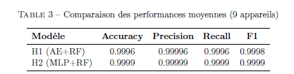

# Détection d'anomalies IoT par hybridation ML/DL

Ce projet est un mini-projet de Master SIDI (Systèmes d'Information Décisionnels et Imagerie) réalisé à la FST Errachidia. Il consiste à concevoir un système intelligent de détection de botnets IoT (Mirai, Gafgyt) en combinant des approches de Machine Learning et de Deep Learning.

**Réalisé par :** RIZQY Mehdi et AIT MOHAMMED Mohammed
**Année universitaire :** 2025-2026

##  Objectifs
Détecter les attaques réseau sur des appareils IoT en temps réel en utilisant une approche hybride, afin de pallier la vulnérabilité des objets connectés.

##  Dataset
Le projet utilise le jeu de données public **N-BaIoT** (UCI Machine Learning Repository). Il contient du trafic réseau réel (normal et attaques) provenant de 9 appareils IoT (caméras, sonnettes, thermostats, etc.) avec 115 caractéristiques statistiques.

##  Modèles Hybrides Développés

### 1. Modèle H1 : Auto-Encoder + Random Forest
- **Architecture :** Un Auto-Encoder (115 → 64 → 32 → 64 → 115) est entraîné uniquement sur les données normales. L'erreur de reconstruction (MSE) sert de caractéristique à un Random Forest (100 arbres) pour classifier normal vs anomalie.
- **Résultats :** Accuracy moyenne de 0.9996.

### 2. Modèle H2 : MLP + Random Forest
- **Architecture :** Un MLP supervisé (115 → 64 → 32 → 1) est entraîné sur les données normales et 20% des attaques. Les activations de l'avant-dernière couche (32 neurones) alimentent un Random Forest (100 arbres).
- **Résultats :** Accuracy moyenne de 0.9999 (légèrement meilleur que H1).

##  Résultats et Interface Graphique
Une interface interactive a été développée avec `ipywidgets` et `matplotlib`. Elle permet de sélectionner l'appareil, de choisir le modèle (H1 ou H2) et de visualiser les métriques (Accuracy, Précision, Rappel, F1-Score) ainsi que la matrice de confusion.

### Comparaison des modèles H1 et H2

### Exemples de Matrices de confusion
| Modèle H1 (Auto-Encoder + RF) | Modèle H2 (MLP + RF) |
| :---: | :---: |
|  |  |
|  |  |
|  |  |

*(D'autres matrices de confusion sont disponibles dans le dossier `Images`)*

##  Comment exécuter le projet
1. Ouvrez le fichier `.ipynb` dans Google Colab ou Jupyter Notebook.
2. Le notebook télécharge automatiquement le dataset N-BaIoT via la commande `!wget`.
3. Exécutez les cellules dans l'ordre pour entraîner les modèles et afficher l'interface interactive.

##  Fichiers du projet
- `Projet_Detection_Anomalies_IoT_RIZQY_Mehdi_AIT_MOHAMMED_Moammed.ipynb` : Le notebook contenant tout le code source.
- `Projet_Detection_Anomalies_IoT_RIZQY_Mehdi_AIT_MOHAMMED_Moammed.pdf` : Le rapport complet du projet.
- `Images/` : Dossier contenant toutes les captures d'écran des matrices de confusion.
